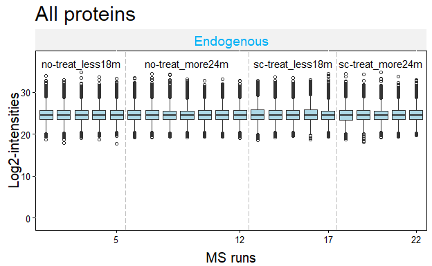
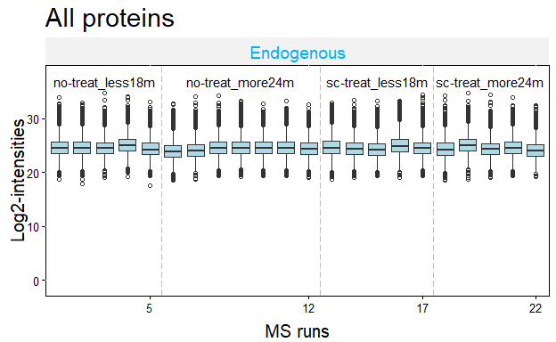

# MaxQuant to MSstats formating, normalization, simple Quality control and generation of wide-formatted tables (for limma input)  

## Load required packages


```r
library(tidyverse)
```

```
## -- Attaching packages --------------------------------------------------------- tidyverse 1.2.1 --
```

```
## v ggplot2 3.2.1     v purrr   0.3.3
## v tibble  2.1.3     v dplyr   0.8.3
## v tidyr   1.0.0     v stringr 1.4.0
## v readr   1.3.1     v forcats 0.4.0
```

```
## -- Conflicts ------------------------------------------------------------ tidyverse_conflicts() --
## x dplyr::filter() masks stats::filter()
## x dplyr::lag()    masks stats::lag()
```

```r
library(MSstats)
```

```
## Warning: replacing previous import 'MASS::select' by 'dplyr::select' when
## loading 'MSstats'
```

## Load input data 


```r
evidence <- read.table(file = here::here("Big_files/evidence_pancan_sc1.txt"),
                       sep = "\t",
                       header = TRUE)

annotation <- read.csv(file = here::here("Data/Pan_Can_Cohort/annotation_pancan_sc1.csv"),
                       header = TRUE)

proteingroups <- read.table(file = here::here("Data/Pan_Can_Cohort/proteinGroups_pancan_sc1.txt"),
                            sep = "\t",
                            header = TRUE)
```

## Transformation from Max Quant format to MSstats format 

With all parameters set to default and including proteins identified with just 1 peptide.  


```r
if(dir.exists(here::here("MSstats_Output_data")) == FALSE){dir.create(here::here("MSstats_Output_data"))}

if(file.exists(x = here::here("MSstats_Output_data/msts_data_w1pep.Rda")) == FALSE){ # check if Rda file with the data is already available. 
      
      msts_data_w1pep <- MaxQtoMSstatsFormat(evidence = evidence,
                                         annotation = annotation,
                                         proteinGroups = proteingroups,
                                         removeProtein_with1Peptide = FALSE)
      
      save(msts_data_w1pep, file = here::here("MSstats_Output_data/msts_data_w1pep.Rda")) # save Rda file for faster loading later if required
      
      if(dir.exists(here::here("MSstats_Output_data/MSstats_formated_tables")) == FALSE){dir.create(here::here("MSstats_Output_data/MSstats_formated_tables"))}
      
      write.csv(x = msts_data_w1pep, file = here::here("MSstats_Output_data/MSstats_formated_tables/msstats_data_protsw1pep.csv")) # protsw1pep means 'this file contains proteins that were identified only with 1 peptide". 
} else {
      
      load(here::here("MSstats_Output_data/msts_data_w1pep.Rda")) # load the Rda file if available.
      
}
```


## Correction of protein IDs  

Get the first listed protein ID when many Uniprot IDs are listed into one Protein Group (many identified peptides matching several proteins in the database)


```r
msts_formated_data <- dplyr::mutate(msts_data_w1pep,
                             ProteinName = stringr::str_remove_all(ProteinName, ";.*$")) %>%
                      dplyr::mutate(ProteinName = stringr::str_trim(ProteinName))
```

## Normalization 

Using default parameters (log2 transformation, normalization by `equalizeMedians` and using all features for quantification).  


```r
dp_all_log2_eqmNorm <- dataProcess(msts_formated_data,
                                   logTrans=2,
                                   normalization="equalizeMedians",
                                   nameStandards=NULL,
                                   address="",
                                   fillIncompleteRows=TRUE,
                                   featureSubset="all",
                                   remove_uninformative_feature_outlier=FALSE,
                                   n_top_feature=3,
                                   summaryMethod="TMP",
                                   equalFeatureVar=TRUE,
                                   censoredInt="NA",
                                   cutoffCensored="minFeature",
                                   MBimpute=TRUE,
                                   remove50missing=FALSE,
                                   maxQuantileforCensored=0.999,
                                   clusters=NULL)
```

```
## ** Log2 intensities under cutoff = 17.777  were considered as censored missing values.
```

```
## ** Log2 intensities = NA were considered as censored missing values.
```

```
## ** Use all features that the dataset origianally has.
```

```
##                        
##   Summary of Features :
##                          count
## # of Protein              2148
## # of Peptides/Protein    1-317
## # of Transitions/Peptide   1-1
```

```
## 
## ** 466 Proteins have only single transition : Consider excluding this protein from the dataset. (A0A075B6K4, A0A075B6P5, A0A0A0MS15, A0A0B4J1X5, A0A0B4J1Y9, A0A0C4DH67, A0A0C4DH73, A0MZ66, A1X283, C9JLW8 ...)
```

```
##                       
##   Summary of Samples :
##                            no-treat_less18m no-treat_more24m sc-treat_less18m
## # of MS runs                              5                7                5
## # of Biological Replicates                5                7                5
## # of Technical Replicates                 1                1                1
##                            sc-treat_more24m
## # of MS runs                              5
## # of Biological Replicates                5
## # of Technical Replicates                 1
```

```
## 
##  Summary of Missingness :
```

```
##   # transitions are completely missing in one condition: 4753
```

```
##     -> ITCSGDALPK_2_NA_NA, ASQSVSSYLAWYQQKPGQAPR_3_NA_NA, LLIYAASTLQSGVPSR_2_NA_NA, LLIYAASSLQSGVPSR_2_NA_NA, FISADVHGIWSR_3_NA_NA ...
```

```
## 
##   # run with 75% missing observations: 0
```

```
## 
##  == Start the summarization per subplot...
```

```
## 
  |                                                                            
  |                                                                      |   0%
  |                                                                            
  |                                                                      |   1%
  |                                                                            
  |=                                                                     |   1%
  |                                                                            
  |=                                                                     |   2%
  |                                                                            
  |==                                                                    |   2%
  |                                                                            
  |==                                                                    |   3%
  |                                                                            
  |==                                                                    |   4%
  |                                                                            
  |===                                                                   |   4%
  |                                                                            
  |===                                                                   |   5%
  |                                                                            
  |====                                                                  |   5%
  |                                                                            
  |====                                                                  |   6%
  |                                                                            
  |=====                                                                 |   6%
  |                                                                            
  |=====                                                                 |   7%
  |                                                                            
  |=====                                                                 |   8%
  |                                                                            
  |======                                                                |   8%
  |                                                                            
  |======                                                                |   9%
  |                                                                            
  |=======                                                               |   9%
  |                                                                            
  |=======                                                               |  10%
  |                                                                            
  |=======                                                               |  11%
  |                                                                            
  |========                                                              |  11%
  |                                                                            
  |========                                                              |  12%
  |                                                                            
  |=========                                                             |  12%
  |                                                                            
  |=========                                                             |  13%
  |                                                                            
  |=========                                                             |  14%
  |                                                                            
  |==========                                                            |  14%
  |                                                                            
  |==========                                                            |  15%
  |                                                                            
  |===========                                                           |  15%
  |                                                                            
  |===========                                                           |  16%
  |                                                                            
  |============                                                          |  16%
  |                                                                            
  |============                                                          |  17%
  |                                                                            
  |============                                                          |  18%
  |                                                                            
  |=============                                                         |  18%
  |                                                                            
  |=============                                                         |  19%
```

```
## Warning in survreg.fit(X, Y, weights, offset, init = init, controlvals =
## control, : Ran out of iterations and did not converge
```

```
## 
  |                                                                            
  |==============                                                        |  19%
  |                                                                            
  |==============                                                        |  20%
  |                                                                            
  |==============                                                        |  21%
  |                                                                            
  |===============                                                       |  21%
  |                                                                            
  |===============                                                       |  22%
  |                                                                            
  |================                                                      |  22%
  |                                                                            
  |================                                                      |  23%
  |                                                                            
  |================                                                      |  24%
  |                                                                            
  |=================                                                     |  24%
  |                                                                            
  |=================                                                     |  25%
  |                                                                            
  |==================                                                    |  25%
  |                                                                            
  |==================                                                    |  26%
  |                                                                            
  |===================                                                   |  26%
  |                                                                            
  |===================                                                   |  27%
  |                                                                            
  |===================                                                   |  28%
  |                                                                            
  |====================                                                  |  28%
  |                                                                            
  |====================                                                  |  29%
  |                                                                            
  |=====================                                                 |  29%
  |                                                                            
  |=====================                                                 |  30%
  |                                                                            
  |=====================                                                 |  31%
  |                                                                            
  |======================                                                |  31%
  |                                                                            
  |======================                                                |  32%
  |                                                                            
  |=======================                                               |  32%
  |                                                                            
  |=======================                                               |  33%
  |                                                                            
  |=======================                                               |  34%
  |                                                                            
  |========================                                              |  34%
  |                                                                            
  |========================                                              |  35%
  |                                                                            
  |=========================                                             |  35%
  |                                                                            
  |=========================                                             |  36%
  |                                                                            
  |==========================                                            |  36%
  |                                                                            
  |==========================                                            |  37%
  |                                                                            
  |==========================                                            |  38%
  |                                                                            
  |===========================                                           |  38%
  |                                                                            
  |===========================                                           |  39%
  |                                                                            
  |============================                                          |  39%
  |                                                                            
  |============================                                          |  40%
  |                                                                            
  |============================                                          |  41%
  |                                                                            
  |=============================                                         |  41%
  |                                                                            
  |=============================                                         |  42%
  |                                                                            
  |==============================                                        |  42%
  |                                                                            
  |==============================                                        |  43%
  |                                                                            
  |==============================                                        |  44%
  |                                                                            
  |===============================                                       |  44%
  |                                                                            
  |===============================                                       |  45%
  |                                                                            
  |================================                                      |  45%
  |                                                                            
  |================================                                      |  46%
  |                                                                            
  |=================================                                     |  46%
  |                                                                            
  |=================================                                     |  47%
  |                                                                            
  |=================================                                     |  48%
  |                                                                            
  |==================================                                    |  48%
  |                                                                            
  |==================================                                    |  49%
  |                                                                            
  |===================================                                   |  49%
  |                                                                            
  |===================================                                   |  50%
  |                                                                            
  |===================================                                   |  51%
  |                                                                            
  |====================================                                  |  51%
  |                                                                            
  |====================================                                  |  52%
  |                                                                            
  |=====================================                                 |  52%
  |                                                                            
  |=====================================                                 |  53%
  |                                                                            
  |=====================================                                 |  54%
  |                                                                            
  |======================================                                |  54%
  |                                                                            
  |======================================                                |  55%
  |                                                                            
  |=======================================                               |  55%
  |                                                                            
  |=======================================                               |  56%
  |                                                                            
  |========================================                              |  56%
  |                                                                            
  |========================================                              |  57%
```

```
## Warning in survreg.fit(X, Y, weights, offset, init = init, controlvals =
## control, : Ran out of iterations and did not converge
```

```
## 
  |                                                                            
  |========================================                              |  58%
  |                                                                            
  |=========================================                             |  58%
  |                                                                            
  |=========================================                             |  59%
  |                                                                            
  |==========================================                            |  59%
  |                                                                            
  |==========================================                            |  60%
  |                                                                            
  |==========================================                            |  61%
  |                                                                            
  |===========================================                           |  61%
  |                                                                            
  |===========================================                           |  62%
  |                                                                            
  |============================================                          |  62%
  |                                                                            
  |============================================                          |  63%
  |                                                                            
  |============================================                          |  64%
  |                                                                            
  |=============================================                         |  64%
  |                                                                            
  |=============================================                         |  65%
  |                                                                            
  |==============================================                        |  65%
  |                                                                            
  |==============================================                        |  66%
  |                                                                            
  |===============================================                       |  66%
  |                                                                            
  |===============================================                       |  67%
  |                                                                            
  |===============================================                       |  68%
  |                                                                            
  |================================================                      |  68%
  |                                                                            
  |================================================                      |  69%
  |                                                                            
  |=================================================                     |  69%
  |                                                                            
  |=================================================                     |  70%
  |                                                                            
  |=================================================                     |  71%
  |                                                                            
  |==================================================                    |  71%
  |                                                                            
  |==================================================                    |  72%
  |                                                                            
  |===================================================                   |  72%
  |                                                                            
  |===================================================                   |  73%
  |                                                                            
  |===================================================                   |  74%
  |                                                                            
  |====================================================                  |  74%
  |                                                                            
  |====================================================                  |  75%
  |                                                                            
  |=====================================================                 |  75%
  |                                                                            
  |=====================================================                 |  76%
  |                                                                            
  |======================================================                |  76%
  |                                                                            
  |======================================================                |  77%
  |                                                                            
  |======================================================                |  78%
  |                                                                            
  |=======================================================               |  78%
  |                                                                            
  |=======================================================               |  79%
  |                                                                            
  |========================================================              |  79%
  |                                                                            
  |========================================================              |  80%
  |                                                                            
  |========================================================              |  81%
  |                                                                            
  |=========================================================             |  81%
  |                                                                            
  |=========================================================             |  82%
  |                                                                            
  |==========================================================            |  82%
  |                                                                            
  |==========================================================            |  83%
  |                                                                            
  |==========================================================            |  84%
  |                                                                            
  |===========================================================           |  84%
  |                                                                            
  |===========================================================           |  85%
  |                                                                            
  |============================================================          |  85%
  |                                                                            
  |============================================================          |  86%
  |                                                                            
  |=============================================================         |  86%
  |                                                                            
  |=============================================================         |  87%
  |                                                                            
  |=============================================================         |  88%
  |                                                                            
  |==============================================================        |  88%
  |                                                                            
  |==============================================================        |  89%
  |                                                                            
  |===============================================================       |  89%
  |                                                                            
  |===============================================================       |  90%
  |                                                                            
  |===============================================================       |  91%
  |                                                                            
  |================================================================      |  91%
  |                                                                            
  |================================================================      |  92%
  |                                                                            
  |=================================================================     |  92%
  |                                                                            
  |=================================================================     |  93%
  |                                                                            
  |=================================================================     |  94%
  |                                                                            
  |==================================================================    |  94%
  |                                                                            
  |==================================================================    |  95%
  |                                                                            
  |===================================================================   |  95%
  |                                                                            
  |===================================================================   |  96%
  |                                                                            
  |====================================================================  |  96%
  |                                                                            
  |====================================================================  |  97%
  |                                                                            
  |====================================================================  |  98%
  |                                                                            
  |===================================================================== |  98%
  |                                                                            
  |===================================================================== |  99%
  |                                                                            
  |======================================================================|  99%
  |                                                                            
  |======================================================================| 100%
```

```
## 
##  == the summarization per subplot is done.
```


## Quality control plots  

#### Normalized data

```r
dataProcessPlots(data = dp_all_log2_eqmNorm, 
                 type="QCplot", 
                 width=7, height=7,
                 which.Protein = 'allonly',
                 address=FALSE)
```

```
## Warning: Removed 166877 rows containing non-finite values (stat_boxplot).
```

```
## Drew the Quality Contol plot(boxplot) for all proteins.
```

<!-- -->

#### Not normalized for comparison  


```r
dataProcessPlots(data = dp_all_log2_noNorm, 
                 type="QCplot", 
                 width=7, height=7,
                 which.Protein = 'allonly',
                 address=FALSE)
```

```
## Warning: Removed 166877 rows containing non-finite values (stat_boxplot).
```

```
## Drew the Quality Contol plot(boxplot) for all proteins.
```

<!-- -->


## Getting tabular data into wide format as an input for Limma  

The `RunlevelData` section of the `list` generated after `dataProcess` by MSstats contains the tabular data.  

The 'Run level data' has information of LogIntensities for proteins per MS Run. The first step before transforming the data into a wide format with 1 line per protein and 1 column per condition will be to take the mean LogIntensities of the Runs per protein.


```r
tab_dp_msts_data <- dp_all_log2_noNorm$RunlevelData
```

#### Create wide tabular data  


```r
tab_selection_msts_data <- dplyr::select(tab_dp_msts_data,
                                    Protein, LogIntensities, Patient = originalRUN, Group = GROUP_ORIGINAL)

tab_wide_msts_data <- pivot_wider(data = tab_selection_msts_data,
                                       names_from = Patient, values_from = LogIntensities) # make data wide

if(dir.exists(here::here("Tabular_data_Limma_input_format")) == FALSE){dir.create(here::here("Tabular_data_Limma_input_format"))}


write_csv(x = tab_wide_msts_data, path = here::here("Tabular_data_Limma_input_format/msstats_tabular_data_for_limma_input.csv"))
```


